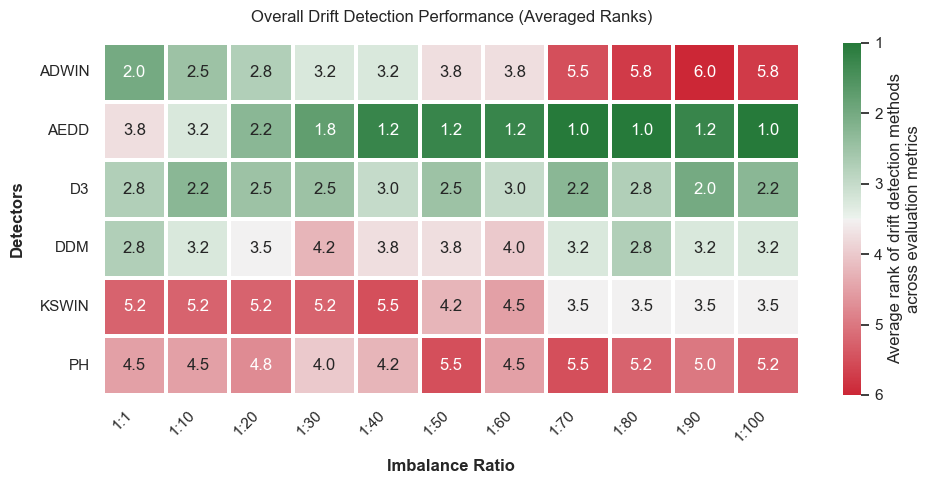
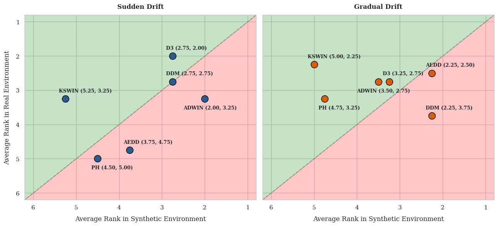
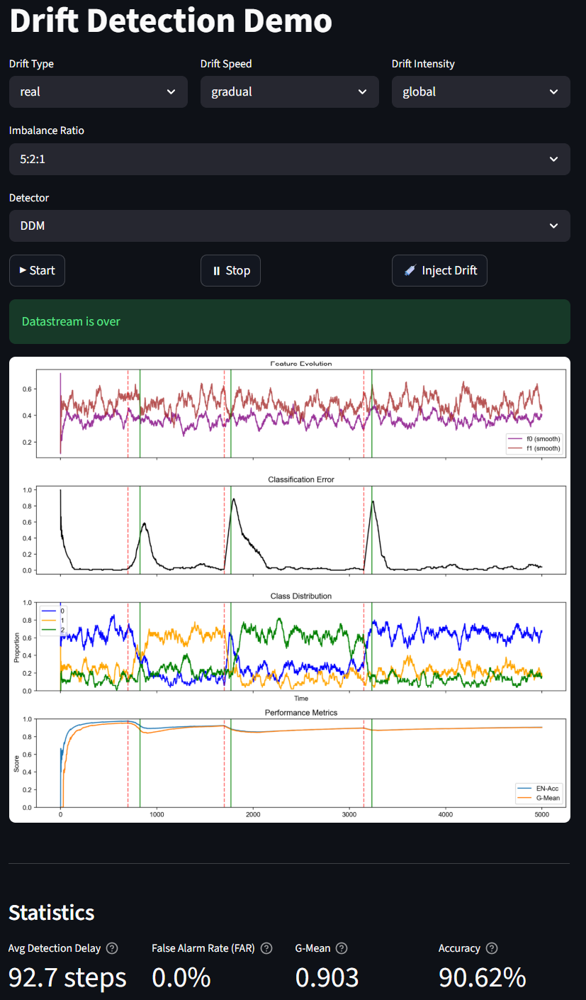

# Concept Drift Detection in Multi-class Imbalanced Data Streams
This thesis investigates the performance of concept drift detection methods in multiclass imbalanced data streams, with a comparative analysis of drift detectors.

**Research gap**: While concept drift detection has been widely studied, most work focuses on binary or balanced data streams.

**Research objective**: This work investigates the behavior of drift detectors in multiclass imbalanced data streams.

## Implemention
1. Data Stream Synthesis:
    - **Random RBF Generator**: Radial basis functions for modeling cluster drift.

2. Drift Detection Framework:
    - **Supervised drift detectors**: DDM (Drift Detection Method), ADWIN (Adaptive Windowing), and PH (Page-Hinkley test)
    - **Unsupervised drift detectors** D3 (Discriminative Drift Detector), AEDD (Autoencoder-based Drift Detector), and PCA-KSWIN (Kolmogorov-Smirnov Windowing).
    

3. Analysis:
    - **Metrics Tracker**: Prequential evaluation with Accuracy, G-Mean, detection delay, FAR
    - **Interactive Demo**: A Streamlit-based web interface for testing detectors in real time.

## Datasets
| Dataset | Type | Features | Classes | Size | IR | Drift points|
|:---|:---|:---|:---|:---|:---|:---|
|**Random RBF**| Synthetic| 30| 8| 100k| 1-100| 20000, 40000, 60000, 80000|
|**Insects abrupt imblanced**| Real| 33| 6| 355k| ~ 8.7 | 83859, 128651, 182320, 242883, 268380|
|**Insects gradual imbalanced**| Real| 33| 6| 143k| ~ 8.7| 58159|

## Results
Performance comparison across drift detectors on the Random RBF data streams based on 5 runs: 



Cross-Environment comparison of drift detection ranks:



## Project Structure
```bash
.
├── data/ # Real datasets 
│ ├── INSECTS abrupt_imbalanced.csv
│ └── INSECTS gradual_imbalanced.csv
├── drift_detection.ipynb # Jupyter notebooks with experiments
├── app.py # Streamlit demo application
├── detectors.py # AE, ADWIN and KSWIN wrapper
├── metrics.py # Metric tracker fro evaluation
├── classifier.py # Hoeffdings tree classifier wrapper
├── stream_generator.py # RandomRBF datastream generator
├── requirements.txt # Python dependencies
└── README.md 
```

## Streamlit demo

This application serves as an empirical verification tool to cross-examine drift detectors under complex multi-class data stream imbalance.

Live Application URL: [https://streamlit.app](https://streamlit.app)


User Interface:



### 1. Parameter Control Panel 
* **Drift Type:** Switches between real (label swap) and virtual (feature scaling) drift types
* **Drift Speed:** Switches between sudden and gradual transition speeds.
* **Drift Influense Zone:** Switches between global (affecting all classes) or local (affecting first class) configuration.
* **Imbalance Ratio:** Controls distribution skewness across a multi-class configuration (from 1:1:1 to 10:1:1 ).
* **Drift Detector:** Switches between 6 drift detectors: DDM, ADWIN, PH, KSWIN, D3, AEDD.

### 2. Control buttons
* **Start Button (▶):** Flushes current experiment and initializes a fresh streaming loop session based on the configured parameters.
* **Stop Button (⏸):** Stops the processing cycle, freezing the temporal execution frame for static analysis.
* **Inject Drift Button (💉):** Manually induces a cncept drift, setting marker to assess detection delay.

### 3. Prequential Data Visualization Panels
* **Feature Space Evolution:** Tracks the rolling mean trajectories of the data streams' dimensional attributes (feature 0 and feature 1).
* **Classification Error Rate:** Tracks the continuous classification error generated by the Hoeffding tree classifier.
* **Class Distribution Profiles:** Visualizes the dynamic proportions of classes.
* **Performance Metrics Tracking:** Monitors the statistical divergence between raw Accuracy and G-Mean tracking curves.

> [!NOTE]
> Red dashed vertical lines (-- ) indicate manual drift injections, while solid green lines (—) pinpoint algorithmic detection flags.

### 4. Evaluation Statistics Section
* **Mean Time to Detection (MTD):** Quantifies the average number of steps between detection and drift.
* **False Alarm Rate (FAR):** Measures the empirical proportion of false alarms relative to the all alerts.
* **Geometric Mean (G-Mean):** Measures how effectively the system maintains classification quality, particularly for minority classes.
* **Accuracy:** Records the ratio of correctly predicted instances to the total number of data points evaluated.

### 5. Local deployment

1. Clone the repository:
```
git clone https://github.com/AnastasiaShvydkaiia/Multiclass-Imbalanced-Concept-Drift-Detection.git
```
2. Create virtual environment:
```
python -m venv venv
source venv/bin/activate 
```
3. Install dependencies:
```
pip install -r requirements.txt
```
4. Run demo:
```
streamlit run app.py
```

