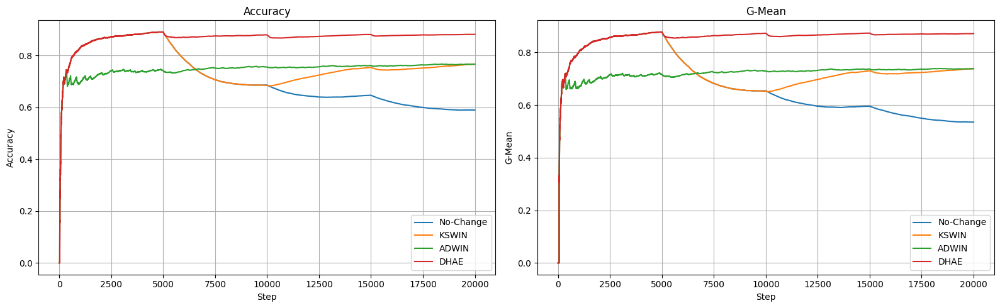

# Concept Drift Detection in Multi-class Imbalanced Data Streams
This thesis investigates concept drift detection in multi-class imbalanced data streams.

## Current Implemention

1. Data Stream Synthesis:
    - **Hyperplane Generator**: Rotating hyperplanes for simulating complex boundary drifts.
    - **Random RBF Generator**: Radial basis functions for modeling cluster drift.

2. Drift Detection Framework:
    - **Baselines**: ADWIN (Adaptive Windowing) and KSWIN (Kolmogorov-Smirnov Windowing).
    - **Proposed Method**: DHAE (Dual-head Autoencoder).

3. Analysis:
    - **Metrics Tracker**: Prequential evaluation with Accuracy, G-Mean, detection delay, false alarms
    - **Interactive Demo**: A Streamlit-based web interface for testing detectors in real time.

## Preliminary results
Performance comparison across three detectors on the Random RBF dataset with 3 abrupt concept drifts (at positions 5000, 10000 and 15000) based on 3 runs: 

| Detector | Prequential Accuracy | G-Mean | Detection Delay | False Alarms |
|:---|:---|:---|:---|:---|
| **ADWIN** | 76.6% | 73.8% | 282 | 45 |
| **KSWIN** | 74.4% | 71.5% | 1543 | 0.33 |
| **DHAE** | **88.1%** | **87.1%** | **105** | **0** |

Prequential plot:


> [!NOTE]
> Final results will include 10 runs with standard deviations.
## Current Project Structure
```bash
.
├── data/ # Real datasets 
│ ├── INSECTS abrupt_imbalanced.csv
│ └── INSECTS gradual_imbalanced.csv
├── drift_detection.ipynb # Jupyter notebooks with experiments
├── app.py # Streamlit demo application
├── detectors.py # AE, ADWIN and KSWIN wrapper
├── metrics.py # Metric tracker fro evaluation
├── classifier.py # Hoeffdings tree classifier wrapper
├── stream_generator.py # RandomRBF datastream generator
├── requirements.txt # Python dependencies
└── README.md 
```
## Running Streamlit demo

1. Clone the repository:
```
git clone https://github.com/AnastasiaShvydkaiia/Multiclass-Imbalanced-Concept-Drift-Detection.git
```
2. Create virtual environment:
```
python -m venv venv
source venv/bin/activate 
```
3. Install dependencies:
```
pip install -r requirements.txt
```
4. Run demo:
```
streamlit run app.py
```
## To Do
- Complete experiments for 10 runs across all datasets.
-  Implement significance testing (e.g., Friedman test) to compare drift detectors' performance.
- Generate final result tables and figures for thesis