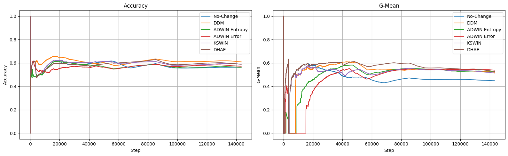
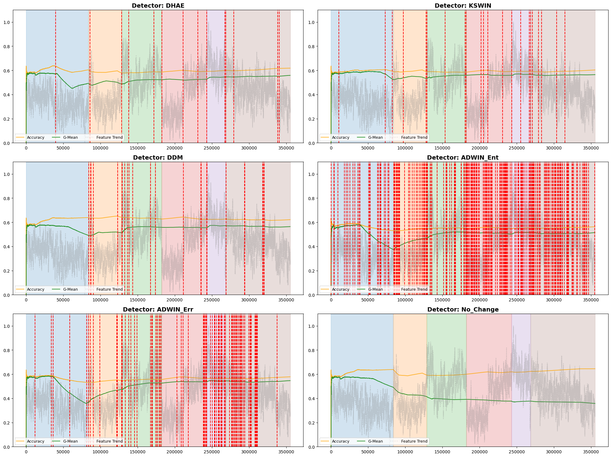
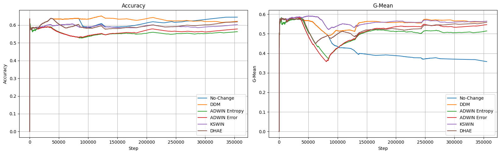
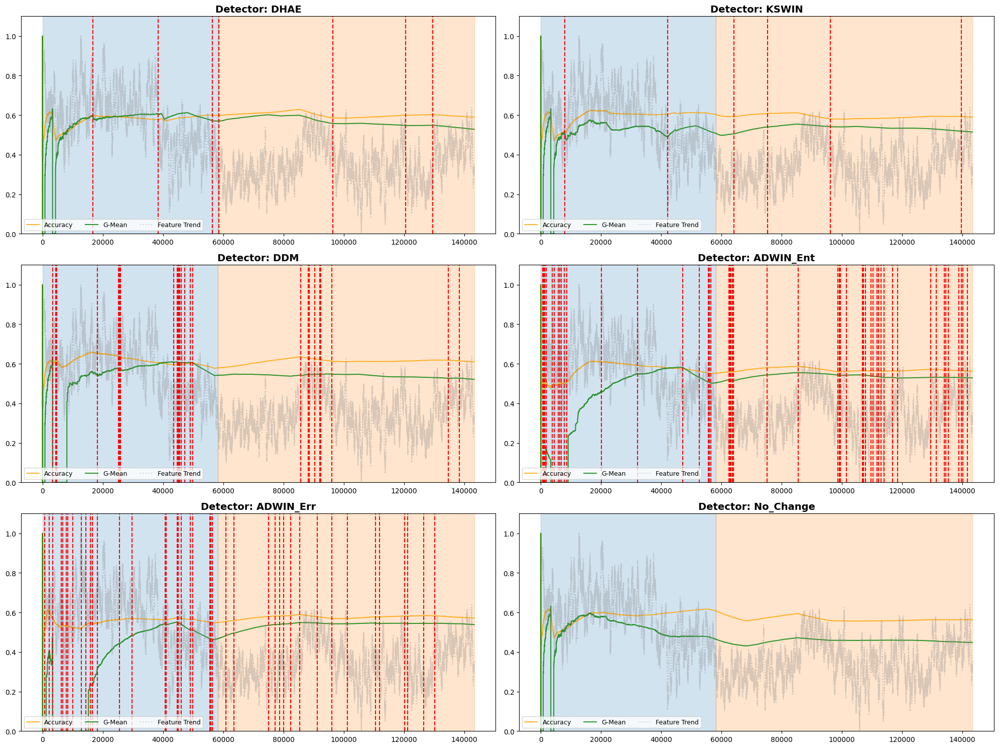

# Concept Drift Detection in Multi-class Imbalanced Data Streams
This repository contains the practical implementation of my Bachelor's Thesis that systematically evaluates how imbalance affects different categories of drift detectors.

**Research gap**: While concept drift detection has been widely studied, most work focuses on binary or balanced data streams.

**Research objective**: This work investigates the behavior of supervised, unsupervised, and hybrid drift detectors in multiclass imbalanced data streams.

This thesis proposes a Dual-Head Autoencoder (DHAE) that jointly monitors feature space and classifier confidence. The method is evaluated against DDM, ADWIN and KSWIN on Random RBF with varying imbalance ratios (mild 1:3, moderate 1:10, severe 1:30) and Insects datasets. The proposed method demonstrates the potential of hybrid approaches, but also highlights the difficulty of balancing detection delay and false alarms undr severe imbalance.

## Implemention
1. Data Stream Synthesis:
    - **Random RBF Generator**: Radial basis functions for modeling cluster drift.

2. Drift Detection Framework:
    - **Baselines**: DDM (Drift Detection Method), ADWIN (Adaptive Windowing) and PCA-KSWIN (Kolmogorov-Smirnov Windowing).
    - **Proposed Method**: DHAE (Dual-head Autoencoder).

3. Analysis:
    - **Metrics Tracker**: Prequential evaluation with Accuracy, G-Mean, detection delay, FAR
    - **Interactive Demo**: A Streamlit-based web interface for testing detectors in real time.

## Datasets
| Dataset | Type | Features | Classes | Size | Imbalance | Drift points|
|:---|:---|:---|:---|:---|:---|:---|
|**Random RBF**| Synthetic| 30| 8| 100k| 1:1, 1:3, 1:10, 1:30| 20000, 40000, 60000, 80000|
|**Insects abrupt imblanced**| Real| 33| 6| 355k| ~ 1:8.7 | 83859, 128651, 182320, 242883, 268380|
|**Insects gradual imbalanced**| Real| 33| 6| 143k| ~ 1:8.7| 58159|

## Results
Performance comparison across drift detectors on the Random RBF dataset with concept drifts at positions 20k, 40k, 60k and 80k, based on 10 runs: 

| Drift Width | Imbalance Ratio | Detector | Accuracy,% | G-mean,% | Delay, steps | FAR,% | HDD,%|
| :---: | :---: | :--- | :---: | :---: | :---: | :---: | :---: |
| **1** | 1:1 | no-change | 78.48±2.75 | 78.42±2.75 | — | — | — |
|  |  | DDM | 86.17±0.51 | 86.13±0.51 | 107.1±11.1 | 22.67±5.33 | 87.11±3.56 |
|  |  | PCA KSWIN | 84.54±1.74 | 84.50±1.74 | 4712.3±4706.8 | 42.00±15.72 | 70.44±13.25 |
|  |  | ADWIN Entropy| 85.60±0.40 | 85.57±0.40 | **57.0±6.8** | 69.49±4.35 | 46.59±5.18 |
|  |  | ADWIN Error	| **86.42±0.47** | **86.38±0.47** |	29.9±4.7 |	38.57±6.80	| 75.88±5.40|
|  |  | DHAE | 86.27±0.48 | 86.23±0.49 | 136.2±69.4 | **18.67±10.67** | **89.33±6.35** |
|  | 1:3 | no-change | 76.50±2.09 | 75.33±2.20 | — | — | — |
|  |  | DDM | **87.05±0.23** | 85.77±0.22 | 121.0±19.4 | **18.33±10.67** | **89.33±6.35** |
|  |  | PCA KSWIN | 84.05±2.12 | 82.90±1.98 | 3264.9±3734.1 | 25.43±24.22 | 80.69±19.62 |
|  |  | ADWIN Entropy | 87.05±0.64 | **85.88±0.58** | 73.0±3.6 | 31.81±10.25 | 80.65±7.32 |
|  |  | ADWIN Error |	86.88±0.78 | 85.65±0.73	| **31.5±1.0**	|44.44±14.05 |	70.31±12.42|
|  |  | DHAE | 86.86±0.60 | 85.64±0.67 | 347.8±490.8 | 28.00±16.00 | 82.54±1.27 |
|  | 1:10 | no-change | 77.65±2.18 | 75.39±2.85 | — | — | — |
|  |  | DDM | 87.02±0.70 | 84.61±0.65 | 111.5±7.9 | **23.33±20.01** | **85.33±12.93** |
|  |  | PCA KSWIN | 86.65±1.15 | 84.32±1.13 | 176.2±16.9 | 39.64±21.08 | 69.57±11.59 |
|  |  | ADWIN Entropy | 87.12±0.71 | 84.62±0.82 | 72.6±9.6 | 35.78±14.81 | 77.20±11.29 |
|  |  | ADWIN Error	|87.17±0.47|	84.62±0.51	| **28.5±4.1** |45.24±6.56	|70.55±5.28|
|  |  | DHAE | **87.27±0.73** | **84.79±0.64** | 89.8±3.34 |25.14±16.20 | 84.65±10.54 |
|  | 1:30 | no-change | 81.48±0.48 | 70.34±2.12 | — | — | — |
|  | | DDM | 89.80±0.81 | 79.55±1.65 | 85.7±28.0 | **71.88±11.96** | **42.35±15.06** |
|  | | PCA KSWIN | 89.80±1.30 | 78.79±2.79 | 409.1±394.4 | 73.53±20.13 | 38.55±20.79 |
|  | | ADWIN Entropy | **90.04±0.78** | **80.36±1.31** | 61.0±1.7 | 73.46±8.27 | 41.28±10.33 |
|  | | ADWIN Error | 90.02±0.75	|79.92±1.45	|**28.0±3.7**|	73.45±8.52	|41.25±10.64|
|  | | DHAE | 89.97±0.61 | 80.03±0.94 | 225.4±17.9 | 74.27±7.46 | 40.37±9.46 |
| **1000** | 1:1 | no-change | 76.39±1.75 | 76.30±1.72 | — | — | — |
|  |  | DDM | **85.97±0.27** | **85.94±0.28** | 460.1±33.8 | **21.22±12.22** | **87.56±7.38** |
|  |  | KSWIN | 80.86±1.96 | 80.82±1.97 | 8554.5±5136.0 | 44.67±8.22 |67.79±11.15 |
|  |  | ADWIN Entropy | 85.30±0.36 | 85.27±0.35 | **294.6±37.8** | 74.80±2.25 | 40.20±2.86 |
|  |  | ADWIN Error |85.63±0.19	|85.60±0.20|	357.5±132.4	|63.52±2.11	|53.43±2.26|
|  |  | DHAE | 85.34±0.66 | 85.31±0.66 | 505.8±32.5 | 53.33±2.27| 63.59±2.51 |
|  |  1:3 | no-change | 78.19±1.44 | 76.98±1.36 | — | — | — |
|  |  | DDM | **86.43±0.50** | **85.18±0.50** | 453.2±19.9 | **19.24±17.31** | **88.32±10.82** |
|  |  | KSWIN | 80.10±3.60 | 79.13±3.49 | 5634.6±2641.7 | 28.57±23.47 | 67.88±2.42 |
|  |  | ADWIN Entropy| 86.00±0.32 | 84.63±0.33 | 401.4±26.2 | 60.51±6.13 | 56.33±6.44 |
|  |  | ADWIN Error	|86.12±0.46|	84.80±0.41	|**223.0±27.9**	|64.51±3.80	|52.27±4.12|
|  |  | DHAE | 86.28±0.48 | 84.99±0.49 | 454.6±21.5 | 56.22±3.09 | 60.81±3.53 |
|  |  1:10 | no-change | 78.92±1.56 | 76.93±1.75 | — | — | — |
|  |  | DDM | 86.60±0.64 | 84.02±0.64 | 448.0±29.7 | **25.90±14.86** | **84.332±9.36** |
|  |  | KSWIN | 83.49±2.66 | 81.12±2.91 | 4638.4±4780.9 | 44.24±28.94 | 63.32±32.14 |
|  |  | ADWIN Entropy| **86.61±0.48** | **84.10±0.46** |  **419.0±63.3**| 62.41±4.52 | 54.48±4.79 |
|  |  | ADWIN Error	|86.27±0.54	|83.76±0.51|	238.7±27.9|	65.47±5.09|	51.13±5.37|
|  |  | DHAE | 85.31±0.81 | 82.53±0.62 | 748.2±44.2 | 80.31±1.29 | 32.89±1.81 |
|  |  1:30 | no-change | 83.18±1.33 | 73.09±1.82 | — | — | — |
|  |  | DDM | 89.47±0.86 | 78.65±1.65 | 416.7±77.9 | **70.64±10.14** | **43.55±11.27** |
|  |  | KSWIN | 87.98±1.79 | 76.27±3.08 | 2899.9±2107.9 | 76.77±10.71 |36.61±12.64 |
|  |  | ADWIN Error| 89.49±0.56 | 78.74±1.45 | 359.4±48.1 | 81.26±4.59 | 31.32±6.43 |
|  |  | ADWIN Error	|**89.54±0.52**	|**78.75±0.86**	|**260.3±33.8**	|79.84±3.97	|33.38±5.45|
|  |  | DHAE | 89.06±0.83 | 77.60±1.50 | 1420.6±603.4 | 80.07±1.59 | 33.20±2.21 |

Performance comparison across drift detectors on the Insects gradual imbalanced dataset based on 10 runs: 

| Detector | Accuracy,% | G-mean,% | Delay, steps | FAR,% | HDD,%|
| :---: | :---: | :--- | :---: | :---: | :---: | 
|no-change |	56.34±0.00|	44.82±0.00|	―|	―	|―	|
|DDM	| **60.93±0.00**	|52.09±0.00|	27513.0±0.0	|	96.15±0.00	|7.41±0.00|
|PCA KSWIN	|58.09±0.53	|50.91±2.12	|14912.6±13211.2	|**82.17±8.16**|	**29.51±10.98**|
|ADWIN Entropy|	56.28±0.00	|52.86±0.0	|4288.0±0.0	|	97.96±0.0|	4.00±0.0|
|ADWIN Error	|57.18±0.00	|**53.85±0.00**	|2811.0±0.0	|	97.62±0.00|	4.65±0.00|
|DHAE	| 58.93±0.04	|52.78±0.00|	**456.0±0.0**|85.71±0.00	|25.00±0.00|

Prequential plot:


Detection plot:


Performance comparison across drift detectors on the Insects adrupt imbalanced dataset based on 10 runs: 

| Detector | Accuracy,% | G-mean,% | Delay, steps | FAR,% | HDD,%|
| :---: | :---: | :--- | :---: | :---: | :---: | 
|no-change 	|64.49±0.00	|35.77±0.00|	―|	―|	―|	
|DDM	|**62.14±0.00**	|**56.39±0.0**	|6224.6±0.0|		83.33±0.00|	28.57±0.00|
|PCA KSWIN	|60.11±0.54	|55.85±0.50	|6912.6±2508.9|		76.98±1.38|	37.40±1.93|
|ADWIN Entropy	|56.29±0.00	|51.44±0.00	|**247.6±0.0**|		97.55±0.00|	4.78±0.00|
|ADWIN Error	|57.81±0.00	|54.65±0.00	|4186.2±0.0|		93.83±0.00|	11.63±0.00|
|DHAE	|61.81±0.00	|55.82±0.00	|567.6±0.0|	**64.29±0.00**|	**52.63±0.00**|

Prequential plot:


Detection plot:


## Project Structure
```bash
.
├── data/ # Real datasets 
│ ├── INSECTS abrupt_imbalanced.csv
│ └── INSECTS gradual_imbalanced.csv
├── drift_detection.ipynb # Jupyter notebooks with experiments
├── app.py # Streamlit demo application
├── detectors.py # AE, ADWIN and KSWIN wrapper
├── metrics.py # Metric tracker fro evaluation
├── classifier.py # Hoeffdings tree classifier wrapper
├── stream_generator.py # RandomRBF datastream generator
├── requirements.txt # Python dependencies
└── README.md 
```
## Running Streamlit demo

1. Clone the repository:
```
git clone https://github.com/AnastasiaShvydkaiia/Multiclass-Imbalanced-Concept-Drift-Detection.git
```
2. Create virtual environment:
```
python -m venv venv
source venv/bin/activate 
```
3. Install dependencies:
```
pip install -r requirements.txt
```
4. Run demo:
```
streamlit run app.py
```